# Installation of Git on Computer

## Requirements  

To install git the following requirements are to be satisfied:
1. Computer or Laptop running:
  * Windows 7 or 8 or 8.1 or 10. Versions below 7 are not preferable.
  * Linux or Unix.
  * macOS.  
2. Internet Connection
3. Disk Space

## Installing Git  
##### These steps are for windows only.
* Step-1 : Visit [https://git-scm.com/downloads](https://git-scm.com/downloads) page.
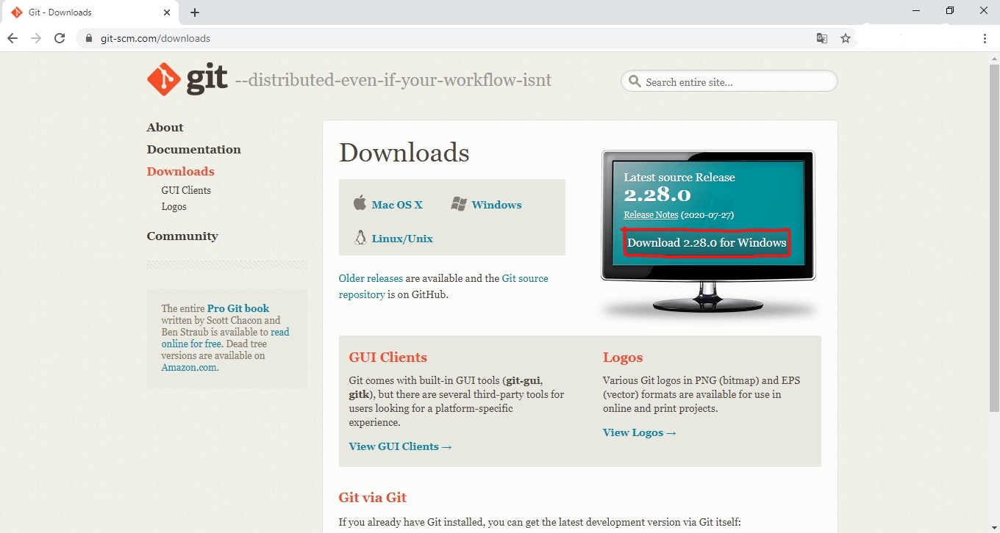  

* Step-2 : Click on "Download for windows button".
* Step-3 : Open the installer and run the setup.  

    Click next.  
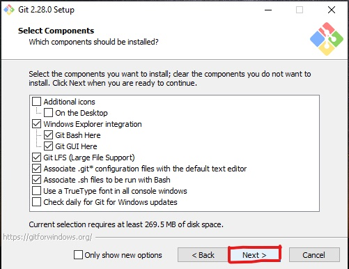    Click next.  
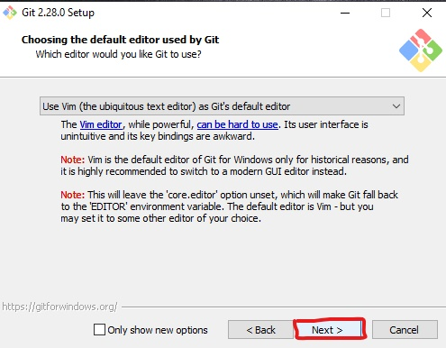    Click next.  
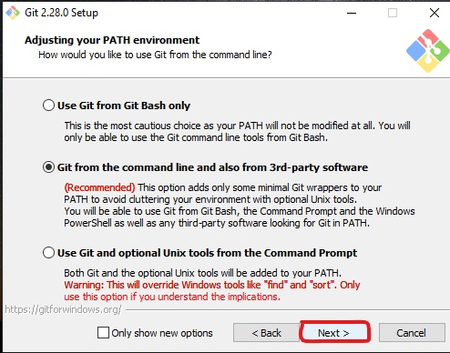    Click next.  
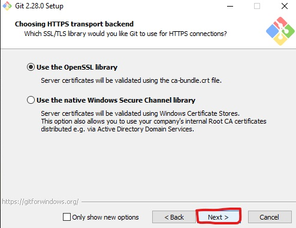    Click next.  
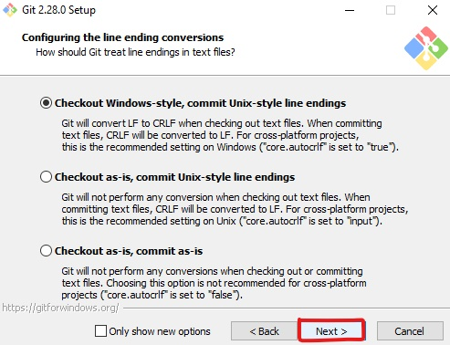    Click next.  
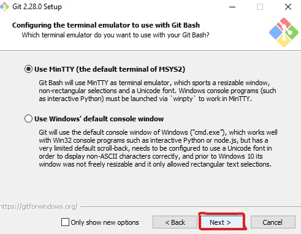    Click next.  
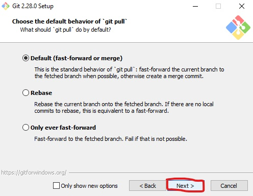    Click next.  
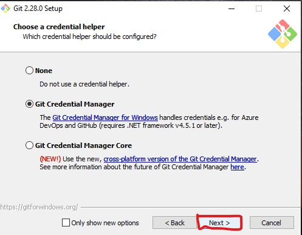    Click next.  
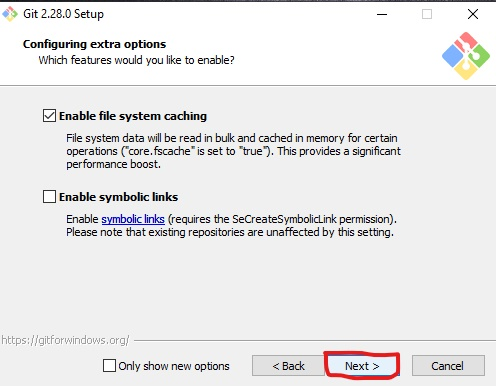    Click next.  
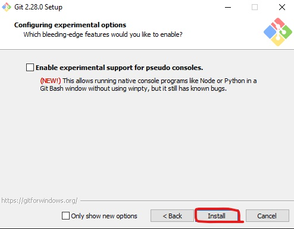    Click next.  

To verify the installation right-click on the desktop. In the menu you must get Git Bash Here and Git GUI here. If not your installation is unsuccessful and you must run the setup once again.   

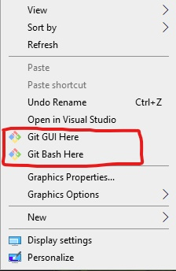
